**Professor: Mohamed Khan**

Group Members:

COMP 246 Team 3

# Part A: Project Scope and Requirements

## Section 1: Problem statement

### **1.1 a) Problem & Need:**

            Navigating college campuses can be challenging for anyone,
especially newcomers who are new to the environment. With multiple ways
to provide information for each event, students may have difficulty
finding their classrooms, locating essential facilities such as the
library or cafeteria, and accessing information about campus. 

To address these issues, a mobile app can be developed to help students
navigate through the college campus more efficiently.

### **1.1 b) List of capabilities and Benefits:**

**Capabilities:**

1.  Interactive map of the campus, with detailed information about each
    building, including classrooms, restrooms, dining halls, and other
    essential facilities.

2.  Personalized schedules that provide the user with a list of their
    classes and the locations of each class, including the time, date,
    and classroom number.

3.  Real-time updates about campus events, such as sports games,
    concerts, and club meetings.

**Benefits:**

1.  Improved efficiency in navigating the campus, which can save
    students time and reduce stress.

2.  Increased engagement with campus events and activities, which can
    enhance the overall college experience.

3.  Better access to essential campus facilities, which can improve
    students' overall well-being and academic performance.

### **1.2 b) Identify the stakeholders and their roles**

- Students

- Professors

- IT department

- School visitors

### **1.3 c) Identify the sub-systems of your application (What are its functional components)**

- Login and Registration

- Map and route Planning

- Search 

- Real-time room availabilities

- Campus Events and updates

- Campus News

- Campus Safety 

- Personalized schedules

- Feedback

- Timing and location of Campus facilities (busy level graphs)

1.  **Login and Registration: ** Handles creation of new accounts with
    the help of campus administration and authenticates users and
    manages system access.

2.  **Map a location**: Handles the interactive maps, GPS tracking, and
    location-based services. Manages parking lot data, availability, and
    suggests parking options based on proximity to destinations.

3.  **Search:**  Provides relevant information on the requested facility
    or feature of the app.

4.  **Booking**: Handles library room booking, parking and peer-tutoring
    session booking. 

5.  **Class schedules:** Allows students to input their class schedules
    into the app. The app can then provide optimized routes and timely
    reminders to help students reach their classes on time. 

6.  **Public Transportation Integration**: Integrates with public
    transportation systems to provide real-time bus schedules, routes,
    and stop locations.

7.  **Notifications:** Updates with modified campus map, route changes,
    reminding services and events 

8.  **User Feedback and Ratings**: Handles the collection, analysis, and
    display of user feedback and ratings for continuous improvement.

### **1.4 d) Who are the intended users of the SRS documentation.**

- School Faculty

- Students

- Public Transportation Authorities

- Campus Administration

- Visitors

## Section 2: A Context Flow – Structured Modelling

### **2.1 - Context Flow Diagram (CFD)**

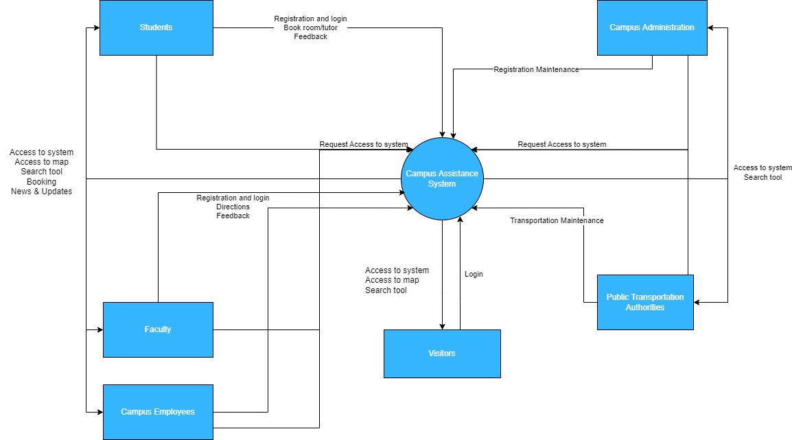

## Section 3: Requirements - functional and non-functional

### 3.1 Non-Functional Requirements

<table>
<colgroup>
<col style="width: 10%" />
<col style="width: 17%" />
<col style="width: 71%" />
</colgroup>
<thead>
<tr class="header">
<th><strong>NFR#</strong></th>
<th><strong>Name</strong></th>
<th><strong>Description</strong></th>
</tr>
</thead>
<tbody>
<tr class="odd">
<td><strong>NFR001</strong></td>
<td>Reliability</td>
<td>
The system should have an uptime of at least 99.9%.

Data loss should not occur during system failures.
</td>
</tr>
<tr class="even">
<td><strong>NFR002</strong></td>
<td>Availability</td>
<td>The system should be available 24/7, except for scheduled
maintenance windows.</td>
</tr>
<tr class="odd">
<td><strong>NFR003</strong></td>
<td>Efficiency</td>
<td>The software system's requirements address capacity, throughput, and
reaction time to requests.</td>
</tr>
<tr class="even">
<td><strong>NFR004</strong></td>
<td>Scalability</td>
<td>The system should support a minimum of 1,000 concurrent users.</td>
</tr>
<tr class="odd">
<td><strong>NFR005</strong></td>
<td>Confidentiality</td>
<td>The system's ability to protect critical data from universities,
designers, students, staff, workers, and newcomers.</td>
</tr>
<tr class="even">
<td><strong>NFR006</strong></td>
<td>Maintainability</td>
<td>The system code should be well-documented and adhere to coding
standards.</td>
</tr>
<tr class="odd">
<td><strong>NFR007</strong></td>
<td>Security</td>
<td>User authentication should be implemented using strong encryption
algorithms</td>
</tr>
<tr class="even">
<td><strong>NFR008</strong></td>
<td>Usability</td>
<td>The system interface should be intuitive and user-friendly.</td>
</tr>
</tbody>
</table>

### 3.2 Goal Use Cases and Use case Diagrams - 3.3 User Story

#### **3.2.1 Login and Registration Subsystems**

| **FR#**  | **Name (Goal Use case)** | **Role Player** | **Description**                                                                                                |
|----------|--------------------------|-----------------|----------------------------------------------------------------------------------------------------------------|
| **FR01** | Login                    | All users       | login to the system by school or guest to access information                                                   |
| **FR02** | Create Profile           | All users       | Registered users provide identity and add specific info.                                                       |
| **FR03** | Update Profile           | All users       | Allows the user to update their existing profile to change personal information, change password, and picture. |
| **FR04** | Register                 | All users       | newly users register to the system to use the functions of the app.                                            |

***Use case Diagram: Login and Registration***

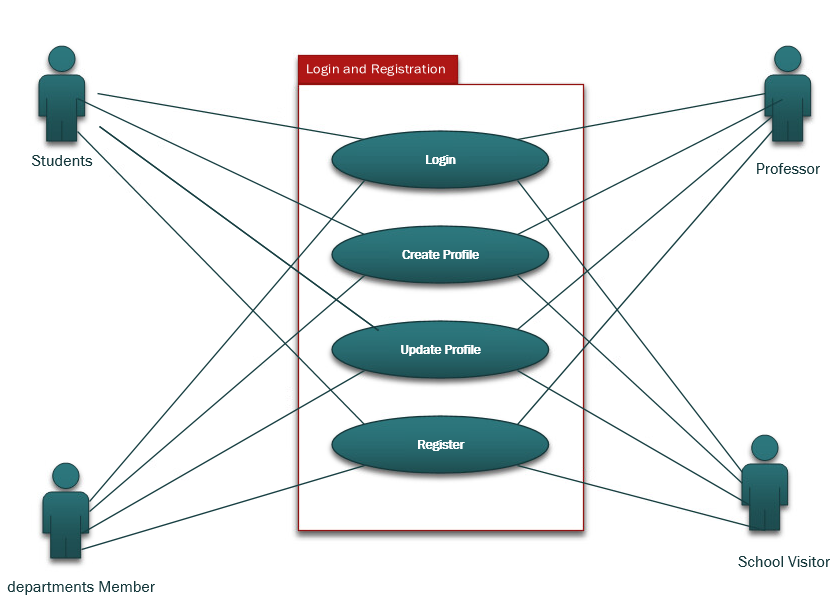

***User Story:***

1.  **As a new user, I want to be able to register on the campus
    navigation app to access all the functionalities of the app.**

> **Acceptance Criteria:**

- **When I open the app, I should see a registration screen with options
  to register as a new user.**

- **Upon selecting the "Register" option and providing necessary
  information such as name, email, and password, my account should be
  created.**

- **After successful registration, I should receive a confirmation email
  with a verification link to verify my email address.**

- **Once I verify my email, I should be able to login to the app using
  the provided credentials and access all the features and information
  available to registered users.**

2.  **As a user, I want to be able to create a profile on the campus
    navigation app to access personalized features and information.**

> **Acceptance Criteria:**

- **When I open the app, I should see a registration screen with options
  to create a profile.**

- **Upon selecting the "Create Profile" option and providing necessary
  information such as name, email, and password, my profile should be
  created.**

- **After successful profile creation, I should be automatically logged
  in and directed to the home screen.**

- **I should receive a confirmation email with a verification link to
  verify my email address.**

3.  **As a registered user, I want to be able to update my profile
    information, including personal details, password, and profile
    picture.**

> **Acceptance Criteria:**

- **On the app's settings or profile page, I should see options to
  update my personal information, change password, and upload a profile
  picture.**

- **When I select the "Update Profile" option, I should be presented
  with editable fields for each piece of information.**

- **After making the necessary changes, I should be able to save the
  updated profile information.**

- **Upon saving, my profile should be updated with the new information
  and the changes should be reflected in my profile.**

4.  **As a guest user, I want to be able to login to the campus
    navigation app to access basic information about the campus.**

> **Acceptance Criteria:**

- **When I open the app, I should see a login screen with options to
  login as a guest.**

- **Upon selecting the "Guest" option and providing necessary
  information, I should be logged in as a guest user.**

- **After successful login, I should be directed to the home screen
  where I can access basic information about the campus.**

#### **3.2.2 Map a Location Subsystems**

| **FR#**  | **Name (Goal Use case)**  | **Role Player** | **Description**                                                 |
|----------|---------------------------|-----------------|-----------------------------------------------------------------|
| **FR01** | Display Campus Map        | All Users       | It will display the whole campus map.                           |
| **FR02** | Show the current location | All users       | It will return the current location where the user is standing. |
| **FR03** | Locate Places             | All Users       | It allows users to locate the places they pin for.              |
| **FR04** | Zoom                      | All Users       | It allows users to zoom the map and see it in more detail.      |

***Use case Diagram: Map a Location***

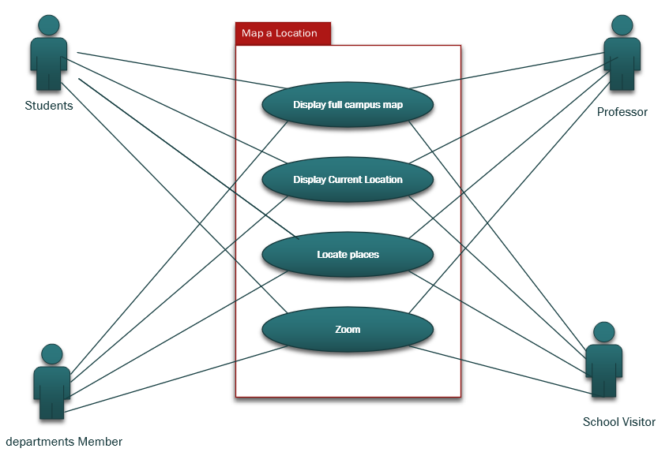

***User Story:***

1.  **As a user, I want a feature which displays the whole campus map at
    once.**

> **Acceptance Criteria:**

- **Should be able to enter for a full map.**

- **Should be able to see the blocks clearly.**

- **Should be able to see the area of the college**

2.  **As a user, I want to get the current location.**

> **Acceptance Criteria:**

- **Should be able to see the nearby buildings, way etc.**

- **Should be able to see the real time location**

3.  **As a user, I want to locate the places where I want to go.**

**Acceptance Criteria:**

- **Should be able to enter a location**

- **Should be able to see the direction**

- **Should be able to see the time required**

- **Should be able to navigate it to the google maps.**

5.  **As a user, I want to see the way and the building more clearly.**

**Acceptance Criteria:**

- **Should be able to use zoom in feature**

- **Should be able to see the alphabets clearly (name of building or
  way).**

- **Should be able to see the zoom out feature  **

#### **3.2.3 Search Subsystem** 

| **FR#**  | **Name (Goal Use case)** | **Role Player** | **Description**                                                                                                                                                                                                              |
|----------|--------------------------|-----------------|------------------------------------------------------------------------------------------------------------------------------------------------------------------------------------------------------------------------------|
| **FR01** | **Enter information**    | **All users**   | **The user will enter information manually such as departments and offices, cafeteria, gym, parking, classes, building, etc.**                                                                                               |
| **FR02** | **Retrieve information** | **All users**   | **The system will display available information in its database that matches the information provided by the user.**                                                                                                         |
| **FR03** | **Navigations**          | **All users**   | **The user is allowed to see the locations and navigate to the desired location from their current location.  Enable users to get accurate navigation and directions from their current location to the searched location.** |
| **FR04** | **Favourites**           | **All user**    | **The users can mark those locations which are difficult to find and those which they frequently use.**                                                                                                                      |

***Use Case Diagram: Search***

*** ***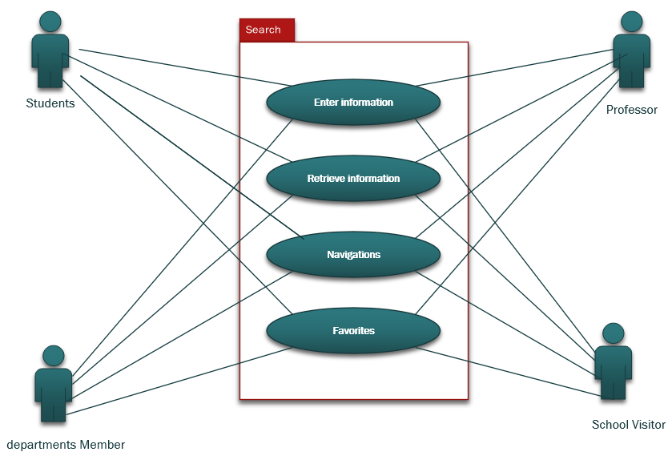

***User Story***

1.  **As a user, I want an efficient search tool so that I can insert
    specific details about my searching.**

> **Acceptance Criteria:**

- **Should be able to enter buildings, classrooms.**

- **Should be able to enter the gym.**

- **Should be able to enter parking’s.**

- **Should be able to enter a cafeteria.**

- **Should be able to enter a library and bookstores.**

- **Should be able to enter departments and offices.**

2.  **As a user, I want an efficient result so that I can find locations
    as per my requirements.**

> **Acceptance Criteria:**

- **Should be able to connect to the database.**

- **Should be able to filter the database content to retrieve matching
  results.**

- **Should be able to display results in a clear format.**

3.  **As a user, I want to get the directions towards the selected
    locations so that I feel convenient to reach there.**

> **Acceptance Criteria:**

- **Should be able to get the directions.**

- **Should be able to show the time required.**

- **Should be able to connect it with google maps.**

- **Should be able to show the name of nearest locations.**

4.  **As a user, I want to create a list of favourites to conveniently
    access the results that I have preferred the most.**

> **Acceptance Criteria:**

- **Should be able to mark favourite locations.**

- **Should be able to mark cross sections.**

- **Should be able to pin the turnings and give it my desired name. for
  my easy access for the next time.**

#### **3.2.4 Booking Subsystem**

| **FR#**  | **Name (Goal Use case)**    | **Role Player**               | **Description**                                                                                                           |
|----------|-----------------------------|-------------------------------|---------------------------------------------------------------------------------------------------------------------------|
| **FR01** | **Reserve Rooms and Books** | **Students, Professors**      | **Users can reserve a room for an approximate of time and users can reserve a library book with their specific program.** |
| **FR02** | **Reserve a Parking Spot**  | **All users**                 | **Users can reserve available parking spot and it also shows current occupied parking spots.**                            |
| **FR03** | **Reserve a Campus tour**   | **School visitors, Students** | **Users can book available Campus tour either with specific programs or without them.**                                   |
| **FR04** | **Schedule an Appointment** | **School visitors, Students** | **Users can schedule an appointment for a tutor, advisor, or professor.**                                                 |

***Use case diagram: Booking***

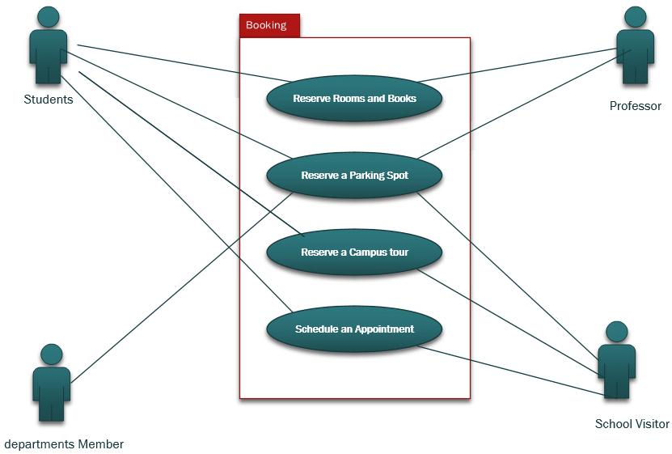

***User Story:***

1.  **As a student, I want to be able to search for available study
    rooms on campus and book a room for a specific time slot.**

> **Acceptance Criteria:**

- **On the app's booking page, I should see an option to search for
  available study rooms.**

- **I can specify the desired date, time slot, and any additional
  preferences (e.g., capacity, amenities) for the study room.**

- **After providing the search criteria, I should see a list of
  available study rooms that match my preferences.**

- **I can select a study room from the list and book it for the
  specified time slot.**

- **Once the room is successfully booked, I should receive a
  confirmation notification with the details of the booking.**

2.  **As a user, I want to be able to reserve a parking spot on campus
    for a specific date and time.**

> **Acceptance Criteria:**

- **On the app's booking page, I should see an option to reserve a
  parking spot.**

- **I can select the desired date and time for which I need a parking
  spot.**

- **The app should display the available parking spots on campus and
  their respective details (e.g., location, capacity).**

- **I can select a parking spot from the list and proceed with the
  reservation.**

- **Once the reservation is confirmed, I should receive a confirmation
  notification with the details of the parking spot reservation.**

3.  **As a prospective student, I want to be able to book a campus tour
    to explore the campus and its facilities.**

> **Acceptance Criteria:**

- **On the app's booking page, I should see an option to book a campus
  tour.**

- **I can select a preferred date and time for the campus tour.**

- **The app should display the available tour slots with information
  about the tour guide and meeting point.**

- **I can select a tour slot and confirm the booking.**

- **After successful booking, I should receive a confirmation
  notification with the details of the campus tour.**

6.  **As a student, I want to be able to schedule an appointment with an
    academic advisor for guidance and assistance.**

> **Acceptance Criteria:**

- **On the app's booking page, I should see an option to schedule an
  appointment with an advisor.**

- **I can select the desired date and time for the appointment.**

- **The app should display the available time slots for each advisor.**

- **I can select an available time slot and provide the purpose or topic
  for the appointment.**

- **After confirming the appointment, I should receive a confirmation
  notification with the details of the scheduled appointment, including
  the advisor's name and contact information.**

## Section 4: UML Domain Class Diagram

### **4.1 - Provide a list of the classes that will contain objects of your application**

- User

- GPS

- Navigation

- Rating

- Services

- Pictures

- Campus

- Notification

- Event

- Favourites

### **4.2 - Domain class diagram**

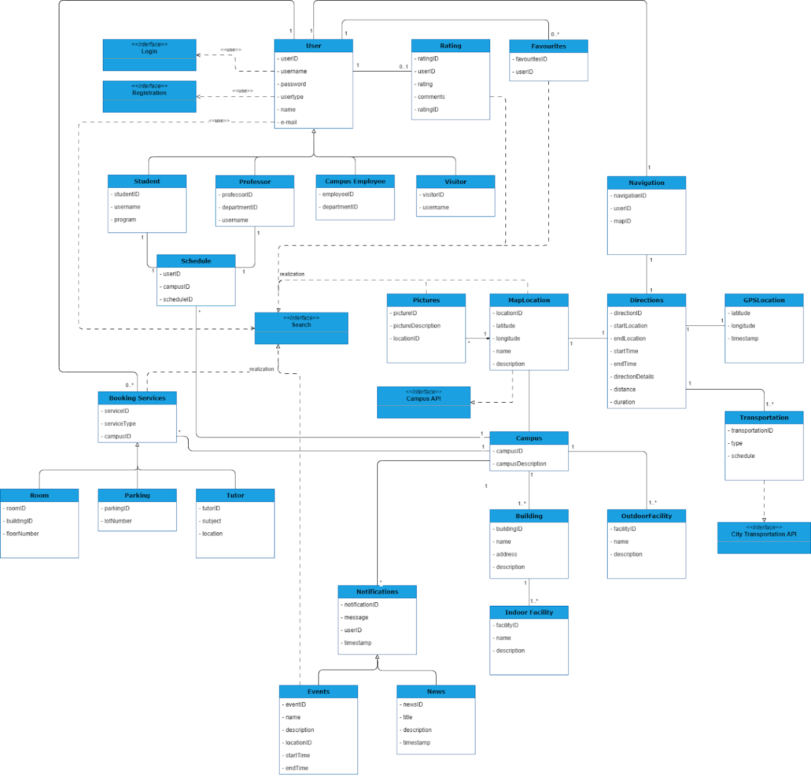

## Section 5: Entity Relationship Diagram

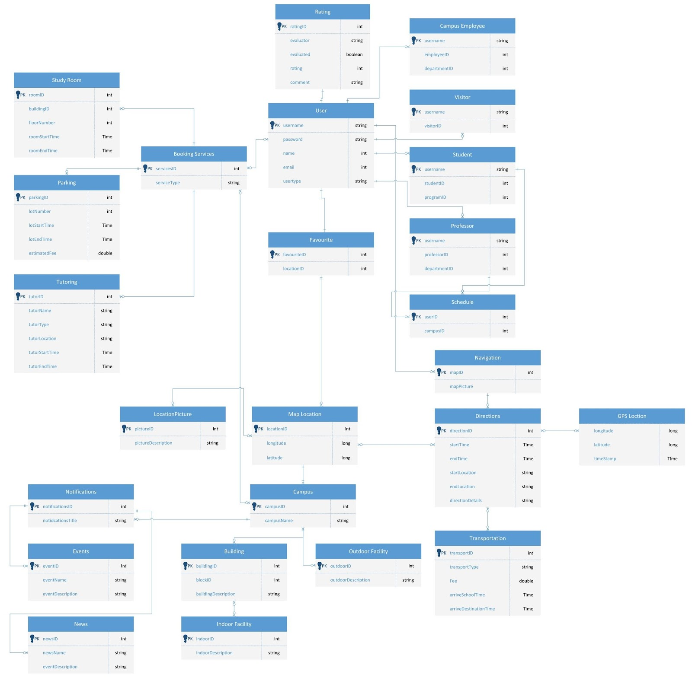

## Section 6: Systems Sequence diagram

### **6.1 - Register (use case - Register in to the System)**

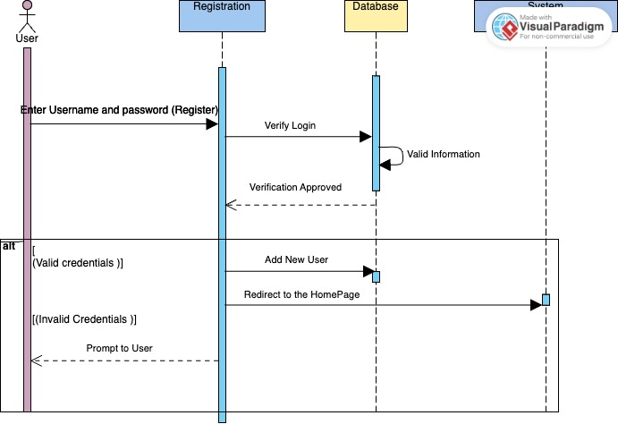

### **6.2 - Login (use case - Login in to the System)**

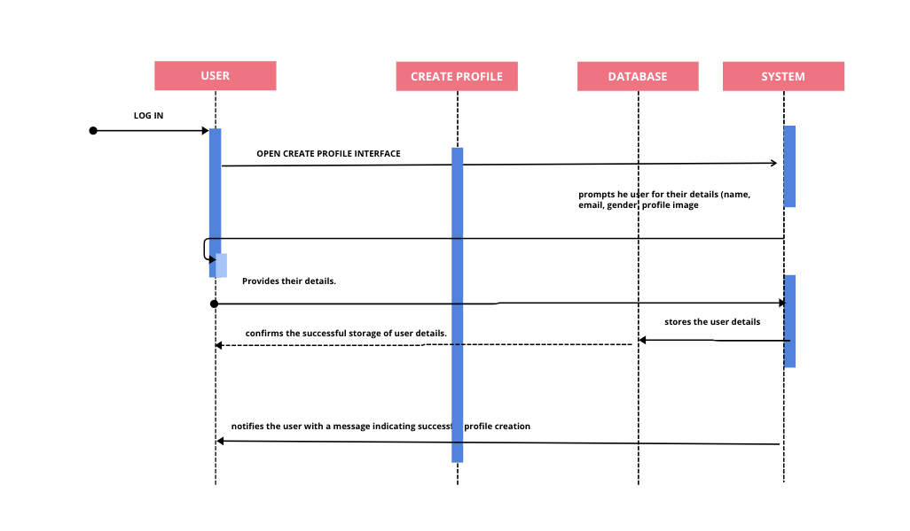

## Section 7: UML State Diagrams 

### **7.1 - Navigation state diagram**

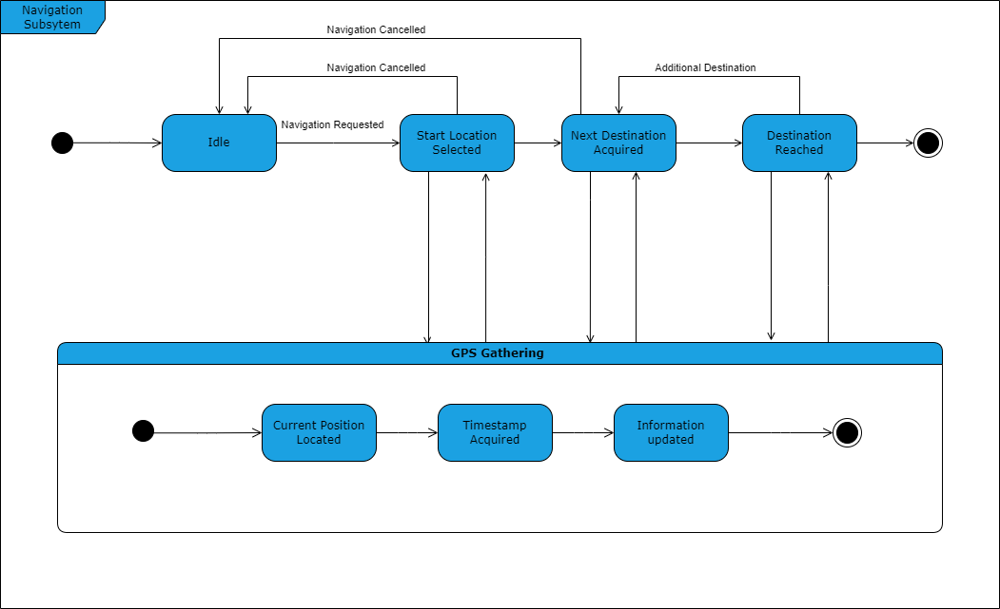

### **7.2 -  Booking state diagram**

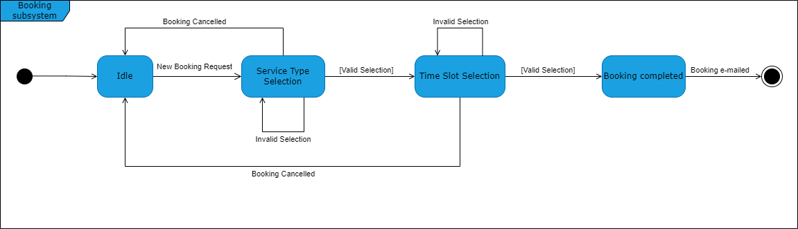

## Section 8: Technologies

**Mobile App:** Java, Swift

**Maps:** Google maps API

**DataBase:** Oracle SQL

**Backend:** Node.js

## Section 9: Project Management

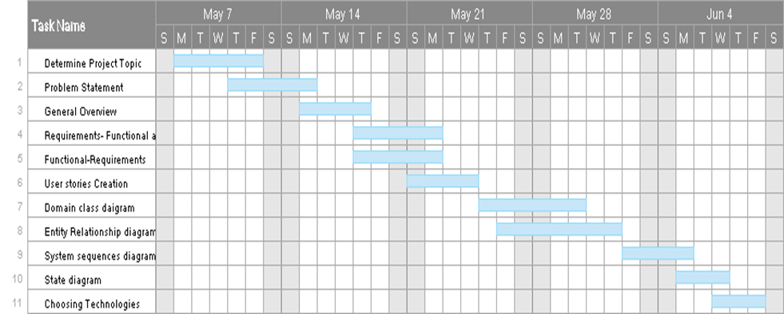
